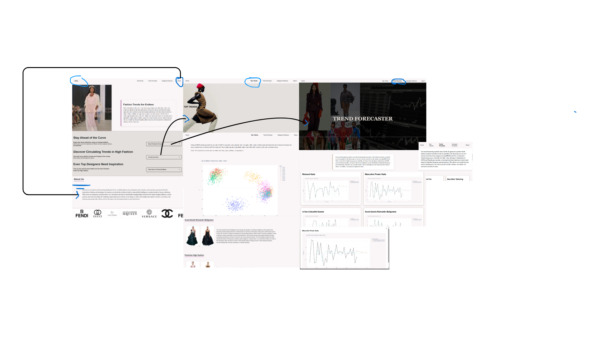

# Fashion Trend Forecasting Dashboard

This project is an interactive dashboard designed to analyze and forecast fashion trends using machine learning and clustering on runway images. It features:

- Unsupervised clustering of designer collections (1994–2024) from top fashion houses
- Trend forecasting using a hybrid LSTM + Transformer model
- Visual summaries of top seasonal trends
- Designer influence network analysis
- Dynamic dashboards built with Flask, Plotly, and Dash

🔗 [Click here to watch the demo on YouTube](https://youtu.be/0qGpMqRX4rs)

## 📁 Features

- **Trend Clustering**: Uses BIRCH and PCA to identify visual fashion trends from runway image embeddings.
- **Forecasting**: Predicts future trend popularity using historical patterns with a custom hybrid model.
- **Web Interface**: Flask-based dashboard for exploring clusters, trends, and forecasted styles.

## 📦 Tech Stack

- Python, Flask, Plotly, Dash
- Hugging Face Datasets
- Scikit-learn, PyTorch, NumPy, Pandas
